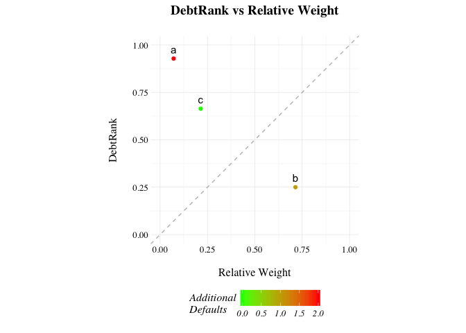

<!-- README.md is generated from README.Rmd. Please edit that file -->
[](https://travis-ci.org/carloscinelli/NetworkRiskMeasures) [](https://codecov.io/github/carloscinelli/NetworkRiskMeasures?branch=master)

The Network Risk Measures (`NetworkRiskMeasures`) package implements some risk measures for (financial) networks, such as DebtRank, Impact Susceptibility, Impact Diffusion and Impact Fluidity.

CRAN
----

The package will soon be on CRAN. We are still implementing some unit testing.

How to install the development version from GitHub
--------------------------------------------------

To install the GitHub version you need to have the package `devtools` installed. Make sure to set the option `build_vignettes = TRUE` to compile the package vignette (but it is not available yet).

``` r
# install.packages("devtools") # run this to install the devtools package
devtools::install_github("carloscinelli/NetworkRiskMeasures", build_vignettes = TRUE)
```

We are looking for interesting public datasets!
-----------------------------------------------

Most bilateral exposures data are confidential and can't be used as examples on the package. So we are looking for interesting, public datasets on bilateral exposures for that purpose. If you have any suggestions, please let us know!

Example usage
-------------

To be expanded.

``` r
library(NetworkRiskMeasures)
#> Loading required package: Matrix

# Creating simple example data
## Assets Matrix (bilateral exposures)
assets_matrix <- matrix(c(0, 10, 3, 1, 0, 2, 0, 3, 0), ncol = 3)
rownames(assets_matrix) <- colnames(assets_matrix) <- letters[1:3]

## Capital Buffer
buffer <- c(a = 2, b = 5, c = 2)

## "Size" of the nodes
weights <-  c(a = 10, b = 100, c = 30)

# DebtRank - computes stress for each node considering its default
dr <- debt_rank(assets_matrix, buffer, weights)
dr
#> 
#> DebtRank (decreasing order):
#>   Stressed Vertex Vertex Weight Additional Stress Number of Additional Defaults
#> 1               a    0.07142857         0.9285714                             2
#> 3               c    0.21428571         0.6642857                             0
#> 2               b    0.71428571         0.2500000                             1

# Experimental plot (with ggplot2)
p <- plot(dr)
p
```



``` r

# Arbitrary shock -- 10% stress shock for each node
shock <- c(a = 0.1, b = 0.1, c = 0.1)
debt_rank_shock(assets_matrix, buffer, weights, shock)
#> 
#> Shock causes additional stress of 16.07% in the network. 
#> Additional defaulted entities: 0 
#> 
#> Stress Levels: 
#>   Vertex Name Vertex Weight Initial Stress Final Stress Diff Stress
#> 1           a    0.07142857            0.1         0.15        0.05
#> 2           b    0.71428571            0.1         0.26        0.16
#> 3           c    0.21428571            0.1         0.30        0.20
#> 
#> A stress level of 1 means default.

## Measures based on the communicability matrix
## Impact Susceptibility, Fluidity and Diffusion
impact_susceptibility(assets_matrix, buffer)
#>    a    b    c 
#> 0.00 1.00 1.25
impact_fluidity(assets_matrix, buffer)
#> [1] 0.75
impact_diffusion(assets_matrix, buffer)
#>   vertex start intermediate total
#> 1      a  1.25          0.0  1.25
#> 2      b  1.00          0.5  1.50
#> 3      c  0.00          0.0  0.00
```
