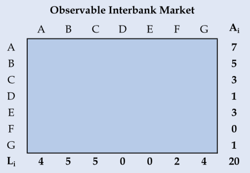
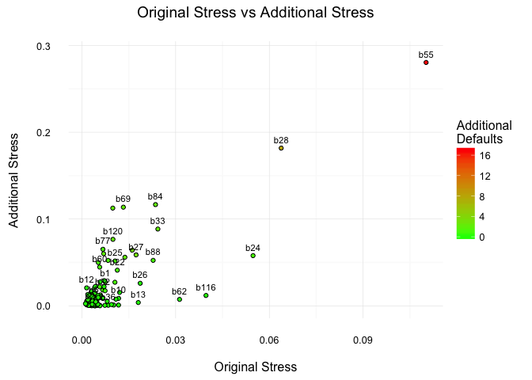
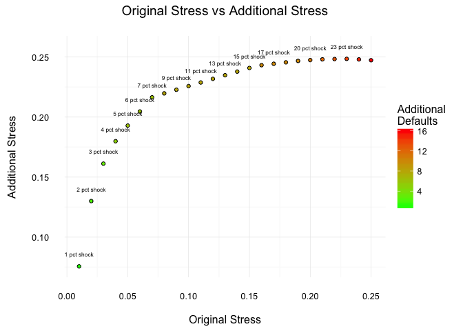

<!-- README.md is generated from README.Rmd. Please edit that file -->
[](https://travis-ci.org/carloscinelli/NetworkRiskMeasures) [](https://cran.r-project.org/package=NetworkRiskMeasures) [](https://codecov.io/github/carloscinelli/NetworkRiskMeasures?branch=master) 

The Network Risk Measures (`NetworkRiskMeasures`) package implements a set of tools to analyze systemic risk in (financial) networks in a unified framework. We currently have implemented:

-   matrix reconstruction methods such as the maximum entropy (Upper, 2004) and minimum density estimation (Anand et al, 2015);
-   a flexible contagion algorithm with: (i) threshold propagation (traditional default cascades), (ii) linear propagation (*aka* DebtRank -- Battiston et al (2012) and Bardoscia et al (2105)), (iii) a combination of threshold and linear propagation (iv) as well as any other custom propagation function provided by the user.
-   network risk measures based on the communicability matrix such as: impact susceptibility, impact diffusion and impact fluidity (Silva et al 2015a and 2015b).

CRAN
----

The package will soon be on CRAN. We are still implementing other methods, improving the unit testing, the documentation and working on the API.

How to install the development version from GitHub
--------------------------------------------------

To install the GitHub version you need to have the package `devtools` installed. Make sure to set the option `build_vignettes = TRUE` to compile the package vignette (not available yet).

``` r
# install.packages("devtools") # run this to install the devtools package
devtools::install_github("carloscinelli/NetworkRiskMeasures", build_vignettes = TRUE)
```

We are looking for interesting public datasets!
-----------------------------------------------

Most bilateral exposures data are confidential and can't be used as examples on the package. So we are looking for interesting, public datasets on bilateral exposures for that purpose. If you have any suggestions, please let us know!

Example usage
-------------

### Filling in the blanks: estimating the adjacency matrix

Many regulators have data on total interbank exposures but do not observe the ***network*** of bilateral exposures. That is, they only know the marginals of the interbank adjacency matrix. Consider the example below with 7 fictitious banks -- banks A through G (Anand et al, 2015, p.628):

<center>

</center>
We know how much each bank has in the interbank market in the form of assets and liabilities (row and column sums)--but we do not know how each bank is related to each other. In those cases, if one wants to run contagion simulations or assess other risk measures, it is necessary to ***estimate*** the interbank network.

Two popular methods for this task are the maximum entropy (Upper, 2004) and minimum density estimation (Anand et al, 2015). These two methods are already implemented on the package. So, let's build the interbank assets and liabilities vectors of our example (which are the row and column sums of the interbank network) to see how the estimation function works:

``` r
# Example from Anand, Craig and Von Peter (2015, p.628)
# Total Liabilities
L <- c(a = 4, b = 5, c = 5, d = 0, e = 0, f = 2, g = 4)

# Total Assets
A <- c(a = 7, b = 5, c = 3, d = 1, e = 3, f = 0, g = 1)
```

For the maximum entropy estimation we can use the `matrix_estimation()` function by providing the row (assets) sums, column (liabilites) sums and the parameter `method = "me"`. The maximum entropy estimate of the interbank network assumes that each bank tries to *diversify* its exposures as evenly as possible, given the restrictions.

``` r
# Loads the package
library(NetworkRiskMeasures)
#> Loading required package: Matrix

# Maximum Entropy Estimation
ME <- matrix_estimation(rowsums = A, colsums = L, method = "me")
#> Starting Maximum Entropy estimation.
#> 
#> - Iteration number: 1 -- abs error: 2.0356 
#> - Iteration number: 2 -- abs error: 0.0555 
#> - Iteration number: 3 -- abs error: 0.004 
#> - Iteration number: 4 -- abs error: 3e-04 
#> 
#> Maximum Entropy estimation finished.
#>  * Total Number of Iterations: 4
#>  * Absolute Error: 3e-04
```

The resulting adjacency matrix is:

``` r
ME <- round(ME, 2)
ME
#>      a    b    c d e    f    g
#> a 0.00 2.53 2.18 0 0 0.74 1.55
#> b 1.72 0.00 1.60 0 0 0.54 1.14
#> c 0.98 1.06 0.00 0 0 0.31 0.65
#> d 0.25 0.27 0.23 0 0 0.08 0.17
#> e 0.75 0.81 0.70 0 0 0.24 0.50
#> f 0.00 0.00 0.00 0 0 0.00 0.00
#> g 0.30 0.32 0.28 0 0 0.09 0.00
```

This solution may work well in some cases, but it does not mimic some properties of interbank networks, which are known to be sparse and disassortative. Therefore, one proposed alternative to the maximum entropy is the "minimum density" estimation by Anand et al (2015). To do that in R, just change the parameter `method` to `"md"` in the `matrix_estimation()` function:

``` r
# Minimum Density Estimation
set.seed(192) # seed for reproducibility
MD <- matrix_estimation(A, L, method = "md")
#> Starting Minimum Density estimation.
#> 
#> - Iteration number: 1 -- total alocated: 0 % 
#> - Iteration number: 2 -- total alocated: 20 % 
#> - Iteration number: 3 -- total alocated: 25 % 
#> - Iteration number: 4 -- total alocated: 30 % 
#> - Iteration number: 5 -- total alocated: 30 % 
#> - Iteration number: 6 -- total alocated: 30 % 
#> - Iteration number: 7 -- total alocated: 30 % 
#> - Iteration number: 8 -- total alocated: 30 % 
#> - Iteration number: 9 -- total alocated: 30 % 
#> - Iteration number: 10 -- total alocated: 30 % 
#> - Iteration number: 11 -- total alocated: 45 % 
#> - Iteration number: 12 -- total alocated: 45 % 
#> - Iteration number: 13 -- total alocated: 55 % 
#> - Iteration number: 14 -- total alocated: 60 % 
#> - Iteration number: 15 -- total alocated: 60 % 
#> - Iteration number: 16 -- total alocated: 60 % 
#> - Iteration number: 17 -- total alocated: 75 % 
#> - Iteration number: 18 -- total alocated: 90 % 
#> - Iteration number: 19 -- total alocated: 90 % 
#> - Iteration number: 20 -- total alocated: 90 % 
#> - Iteration number: 21 -- total alocated: 90 % 
#> - Iteration number: 22 -- total alocated: 100 % 
#> 
#> Minimum Density estimation finished.
#>  * Total Number of Iterations: 22
#>  * Total Alocated: 100 %
```

The resulting adjacency matrix is:

``` r
MD
#>   a b c d e f g
#> a 0 3 0 0 0 0 4
#> b 3 0 2 0 0 0 0
#> c 0 2 0 0 0 1 0
#> d 0 0 0 0 0 1 0
#> e 0 0 3 0 0 0 0
#> f 0 0 0 0 0 0 0
#> g 1 0 0 0 0 0 0
```

We intend to implement other estimation methods used in the literature. For an overview of current proposed methods and how well they fit known networks, you may watch Anand's presentation below:

<center>
<iframe src="https://player.vimeo.com/video/145290048" width="640" height="360" frameborder="0" webkitallowfullscreen mozallowfullscreen allowfullscreen>
</iframe>
<p>
<a href="https://vimeo.com/145290048">The missing links: a global study on uncovering financial network structure from partial data</a> from <a href="https://vimeo.com/cambridgejbs">Cambridge Judge Business School</a> on <a href="https://vimeo.com">Vimeo</a>.
</p>
</center>
### Measuring risk: findind systemically important institutions and simulating scenarios

Two important questions:

-   How can we find important or systemic institutions?
-   How can we estimate the impact of shock scenarios, considering possible contagion effects?

#### The example data: simulated interbank network

For illustration purposes, the `NetworkRiskMeasures` package comes with a simulated dataset of interbank assets, liabilities, capital buffer and weights for 125 nodes. Let's use it for our analysis:

``` r
# See the code to generate the dataset in the help files: ?sim_data.
data("sim_data")
head(sim_data)
#>   bank     assets liabilities   buffer   weights
#> 1   b1 0.37490927   9.6317127 5.628295 17.119551
#> 2   b2 0.66805904   0.7126552 2.847072  6.004475
#> 3   b3 0.79064804   0.3089983 3.983451  6.777531
#> 4   b4 0.02420156   0.6562193 5.657779  7.787618
#> 5   b5 0.65294261   0.9153901 4.446595  8.673730
#> 6   b6 0.60766835   0.3007373 2.252369  4.708805
```

In this example, we do not observe the real network, only the marginals (total assets and liabilities). Thus, we must estimate the adjacency matrix before running the contagion simulations or calculating other network measures. For now, we will use the minimum density estimation:

``` r
# seed - min. dens. estimation is stochastic
set.seed(15) 

# minimum density estimation
# verbose = F to prevent printing
md_mat <- matrix_estimation(sim_data$assets, sim_data$liabilities, method = "md", verbose = F)

# rownames and colnames for the matrix
rownames(md_mat) <- colnames(md_mat) <- sim_data$bank
```

Once we have our network, we can visualise it either using `igraph` or `ggplot2` along with the `ggnetwork` package. Below we give an example with `ggplot2` -- it's useful to remember that we have an *assets matrix*, so *a* → *b* means that node *a* has an asset with node *b*:

``` r
library(ggplot2)
library(ggnetwork)
library(igraph)

# converting our network to an igraph object
gmd <- graph_from_adjacency_matrix(md_mat, weighted = T)

# adding other node attributes to the network
V(gmd)$buffer <- sim_data$buffer
V(gmd)$weights <- sim_data$weights/sum(sim_data$weights)
V(gmd)$assets  <- sim_data$assets
V(gmd)$liabilities <- sim_data$liabilities

# ploting with ggplot and ggnetwork
set.seed(20)
netdf <- ggnetwork(gmd)

ggplot(netdf, aes(x = x, y = y, xend = xend, yend = yend)) + 
  geom_edges(arrow = arrow(length = unit(6, "pt"), type = "closed"), 
             color = "grey50", curvature = 0.1, alpha = 0.5) + 
  geom_nodes(aes(size = weights)) + 
  ggtitle("Estimated interbank network") + 
  theme_blank()
```


As one can see, the resulting network is sparse and disassortative:

``` r
# network density
edge_density(gmd)
#> [1] 0.01619355

# assortativity
assortativity_degree(gmd)
#> [1] -0.4018922
```

#### Finding central, important or systemic nodes on the network

How can we find the important (central) or systemic banks in our network?

##### Traditional centrality measures, impact susceptibility and impact diffusion

A first approach to this problem would be to use traditional centrality measures from network theory. You can calculate those easily with packages like `igraph`:

``` r
sim_data$degree <- igraph::degree(gmd)
sim_data$btw    <- igraph::betweenness(gmd)
sim_data$close  <- igraph::closeness(gmd)
sim_data$eigen  <- igraph::eigen_centrality(gmd)$vector
sim_data$alpha  <- igraph::alpha_centrality(gmd, alpha = 0.5)
```

Other interesting measures are the impact susceptibility and impact diffusion. These are implemented in the `NetworkRiskMeasures` package with the `impact_susceptibility()` and `impact_diffusion()` functions.

The impact susceptibility measures the feasible contagion paths that can reach a vertex in relation to its direct contagion paths. When the impact susceptibility is greater than 1, that means the vertex is vulnerable to other vertices beyond its direct neighbors (remotely vulnerable).

The impact diffusion tries to capture the influence exercised by a node on the propagation of impacts in the network. The impact diffusion of a vertex is measured by the change it causes on the impact susceptibility of other vertices when its power to propagate contagion is removed from the network.

``` r
sim_data$imps <- impact_susceptibility(exposures = gmd, buffer = sim_data$buffer)
sim_data$impd <- impact_diffusion(exposures = gmd, buffer = sim_data$buffer, weights = sim_data$weights)$total
```

Notice that both the traditional metrics and the communicability measures depend on network topology but do not depend on a specific shock.

##### Contagion metrics: default cascades and DebtRank

The previous metrics might not have an economically meaningful interpretation. So another way to measure the systemic importance of a bank is to answer the following question: how would the default of the entity impact the system?

To simulate a contagion process in the network we can use the `contagion()` function. The main arguments of the function are the exposure matrix, the capital buffer and the node's weights. You may choose different propagation methods or even provide your own. Right now, let's see only two different approaches for the propagation: the traditional default cascade and the DebtRank.

The DebtRank methodology proposed by Bardoscia et al (2015) considers a linear shock propagation --- briefly, that means that when a bank loses, say, 10% of its capital buffer, it propagates losses of 10% of its debts to its creditors. If you run the `contagion()` function with parameters `shock = "all"` and `method = "debtrank"`, you will simulate the default of each bank in the network using the DebtRank methodology (linear propagation).

``` r
# DebtRank simulation
contdr <- contagion(exposures = md_mat, buffer = sim_data$buffer, weights = sim_data$weights, 
                    shock = "all", method = "debtrank", verbose = F)
summary(contdr)
#> Contagion Simulations Summary
#> 
#> Info:
#>  Propagation Function: debtrank 
#>  With parameters: 
#> data frame with 0 columns and 0 rows
#> 
#> Simulation summary (showing 10 of 125 -- decreasing order of additional stress):
#>  Scenario Original Stress Additional Stress Original Losses Additional Losses Additional Defaults
#>       b55          0.1102             0.280            58.4             235.8                  17
#>       b28          0.0638             0.182            63.5              99.3                   8
#>       b84          0.0236             0.117             7.6              65.7                   2
#>       b69          0.0133             0.114            13.0              36.6                   2
#>       b75          0.0099             0.113             9.6              30.5                   2
#>       b33          0.0243             0.088            27.4              33.6                   2
#>      b120          0.0099             0.077             8.4              18.1                   2
#>       b77          0.0067             0.065             9.4               8.9                   1
#>       b74          0.0161             0.064            14.4              27.9                   3
#>      b101          0.0070             0.060             9.3              17.1                   2
```

What do these results mean?

Take, for instance, the results for bank `b55`. It represents 11% of our simulated financial system. However, if we consider a linear shock propagation, its default causes an additional stress of 28% of the system, with additional losses of $235.8 billion and the default of 18 other institutions. Or take the results for `b69` --- although it represents only 1.3% of the system, its default casuses an additional stress of almost ten times its size.

``` r
plot(contdr)
```



You don't need to interpret these results too literally. You could use the additional stress indicator (the DebtRank) as a measure of the systemic importance of the institution:

``` r
contdr_summary <- summary(contdr)
sim_data$DebtRank <- contdr_summary$summary_table$additional_stress
```

One can also consider a different propagation method. For example, a bank may not transmit contagion unless it defaults. To do that, just change the contagion method to `threshold`.

``` r
# Traditional default cascades simulation
contthr <-  contagion(exposures = md_mat, buffer = sim_data$buffer, weights = sim_data$weights, 
                      shock = "all", method = "threshold", verbose = F)
summary(contthr)
#> Contagion Simulations Summary
#> 
#> Info:
#>  Propagation Function: threshold 
#>  With parameters: 
#> data frame with 0 columns and 0 rows
#> 
#> Simulation summary (showing 10 of 125 -- decreasing order of additional stress):
#>  Scenario Original Stress Additional Stress Original Losses Additional Losses Additional Defaults
#>       b55          0.1102             0.273            58.4             221.1                  16
#>       b28          0.0638             0.167            63.5              88.4                   7
#>       b84          0.0236             0.098             7.6              62.0                   2
#>       b69          0.0133             0.096            13.0              34.1                   2
#>       b75          0.0099             0.095             9.6              28.1                   2
#>      b120          0.0099             0.075             8.4              17.0                   2
#>       b27          0.0173             0.059            20.5              18.8                   3
#>       b74          0.0161             0.056            14.4              26.1                   3
#>      b101          0.0070             0.052             9.3              15.6                   2
#>       b80          0.0084             0.051             9.2               7.5                   1
```

Let's save the results in our `sim_data` along with the other metrics:

``` r
contthr_summary <- summary(contthr)
sim_data$cascade <- contthr_summary$summary_table$additional_stress
```

Now we have all of our indicators in the `sim_data` `data.frame`:

``` r
head(sim_data)
#>   bank     assets liabilities   buffer   weights degree btw        close       eigen     alpha imps     impd
#> 1   b1 0.37490927   9.6317127 5.628295 17.119551      3 158 6.285375e-04 0.014737561 63.574054    0 27.66536
#> 2   b2 0.66805904   0.7126552 2.847072  6.004475      2   0 6.556480e-05 0.009530187  1.439016    0  0.00000
#> 3   b3 0.79064804   0.3089983 3.983451  6.777531      2   6 6.609795e-05 0.004553244  1.180453    0  0.00000
#> 4   b4 0.02420156   0.6562193 5.657779  7.787618      3 802 6.431771e-04 0.002843708 16.669921    0  0.00000
#> 5   b5 0.65294261   0.9153901 4.446595  8.673730      2  14 6.609864e-05 0.003889006  2.945919    0  0.00000
#> 6   b6 0.60766835   0.3007373 2.252369  4.708805      2   2 6.556680e-05 0.001567357  1.287698    0  0.00000
#>       DebtRank      cascade
#> 1 0.0278774471 0.0187702836
#> 2 0.0015547276 0.0014304155
#> 3 0.0005985364 0.0005137390
#> 4 0.0074578714 0.0023841317
#> 5 0.0093804082 0.0076966953
#> 6 0.0009334068 0.0005486289
```

We may see how some of these different metrics rank each of the nodes. For instance, the DebtRank and the Default Cascade indicators agree up to the first five institutions.

``` r
rankings <- sim_data[1]
rankings <- cbind(rankings, lapply(sim_data[c("DebtRank","cascade","degree","eigen","impd","assets", "liabilities", "buffer")], 
                                   function(x) as.numeric(factor(-1*x))))
rankings <- rankings[order(rankings$DebtRank), ]
head(rankings, 10)
#>     bank DebtRank cascade degree eigen impd assets liabilities buffer
#> 55   b55        1       1      1     1    1     40           1      2
#> 28   b28        2       2      3    18    2     85           2      1
#> 84   b84        3       3      8     4    5     78           3     29
#> 69   b69        4       4     12     9    5     95           8      7
#> 75   b75        5       5     15    15    5     46          12      9
#> 33   b33        6      17      9    58   18     51           4      3
#> 120 b120        7       6     13    46    7     59          11     23
#> 77   b77        8      29     15    63   21    101          28     11
#> 74   b74        9       8      8    31   10     86           5      5
#> 101 b101       10       9     13    74   15    113          25     13
```

And the cross-correlations between the metrics:

``` r
cor(rankings[-1])
#>                DebtRank     cascade    degree     eigen       impd       assets liabilities     buffer
#> DebtRank     1.00000000  0.93231850 0.3842379 0.4768787 0.60635065 -0.069485591 0.844166766  0.4373012
#> cascade      0.93231850  1.00000000 0.4070260 0.5430477 0.62448228 -0.010841119 0.858208779  0.3953692
#> degree       0.38423792  0.40702597 1.0000000 0.5332633 0.52451198  0.415204147 0.399596081  0.2552769
#> eigen        0.47687869  0.54304771 0.5332633 1.0000000 0.49012583  0.441087558 0.512325653  0.1465438
#> impd         0.60635065  0.62448228 0.5245120 0.4901258 1.00000000  0.018459808 0.610921083  0.4816576
#> assets      -0.06948559 -0.01084112 0.4152041 0.4410876 0.01845981  1.000000000 0.004958525 -0.1198280
#> liabilities  0.84416677  0.85820878 0.3995961 0.5123257 0.61092108  0.004958525 1.000000000  0.3930261
#> buffer       0.43730120  0.39536923 0.2552769 0.1465438 0.48165762 -0.119827957 0.393026114  1.0000000
```

#### Simulating arbitrary contagion scenarios

The `contagion()` function is flexible and you can simulate arbitrary scenarios with it. For example, how would simultaneous stress shocks of 1% up to 25% in all banks affect the system? To do that, just creat a list with the shock vectors and pass it to `contagion()`.

``` r
s <- seq(0.01, 0.25, by = 0.01)
shocks <- lapply(s, function(x) rep(x, nrow(md_mat)))
names(shocks) <- paste(s*100, "pct shock")

cont <- contagion(exposures = gmd, buffer = sim_data$buffer, shock = shocks, weights = sim_data$weights, method = "debtrank", verbose = F)
summary(cont)
#> Contagion Simulations Summary
#> 
#> Info:
#>  Propagation Function: debtrank 
#>  With parameters: 
#> data frame with 0 columns and 0 rows
#> 
#> Simulation summary (showing 10 of 25 -- decreasing order of additional stress):
#>      Scenario Original Stress Additional Stress Original Losses Additional Losses Additional Defaults
#>  23 pct shock            0.23              0.25             182               179                  14
#>  22 pct shock            0.22              0.25             174               173                  13
#>  21 pct shock            0.21              0.25             166               167                  12
#>  24 pct shock            0.24              0.25             190               185                  15
#>  20 pct shock            0.20              0.25             158               161                  11
#>  25 pct shock            0.25              0.25             198               191                  16
#>  19 pct shock            0.19              0.25             150               155                  10
#>  18 pct shock            0.18              0.25             142               149                  10
#>  17 pct shock            0.17              0.24             134               142                  10
#>  16 pct shock            0.16              0.24             127               136                  10
```

``` r
plot(cont, size = 2.2)
```



In this example, a 5% shock in all banks causes an additional stress of 20% in the system, an amplification of 4 times the initial shock.

#### Creating your own propagation method

To be expanded.

#### References

[Anand, K., Craig, B. and G. von Peter (2015). Filling in the blanks: network structure and interbank contagion. Quantitative Finance 15:4, 625-636.](http://www.tandfonline.com/doi/full/10.1080/14697688.2014.968195)

[Bardoscia M, Battiston S, Caccioli F, Caldarelli G (2015) DebtRank: A Microscopic Foundation for Shock Propagation. PLoS ONE 10(6): e0130406. doi: 10.1371/journal.pone.0130406](http://journals.plos.org/plosone/article?id=10.1371%2Fjournal.pone.0130406)

[Silva, T.C.; Souza, S.R.S.; Tabak, B.M. (2015) Monitoring vulnerability and impact diffusion in financial networks. Working Paper 392, Central Bank of Brazil.](http://www.bcb.gov.br/pec/wps/ingl/wps392.pdf)

[Silva, T.C.; Souza, S.R.S.; Tabak, B.M. (2015) Network structure analysis of the Brazilian interbank market . Working Paper 391, Central Bank of Brazil.](http://www.bcb.gov.br/pec/wps/ingl/wps391.pdf)

[Upper, C. and A. Worm (2004). Estimating bilateral exposures in the german interbank market: Is there a danger of contagion? European Economic Review 48, 827-849.](http://www.sciencedirect.com/science/article/pii/S0014292104000145)
